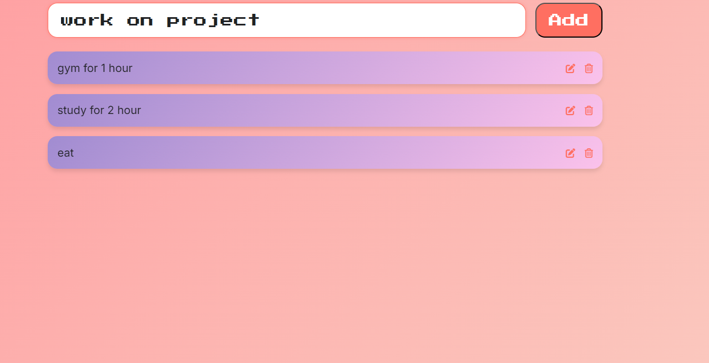

# React Todo List

React Todo List is a simple and efficient application for managing daily tasks. Built with **React** and **Vite**, this project provides a clean and responsive user interface for tracking and organizing to-dos.

## Project Screenshots

Here is a screenshot of the project:



## Project Setup

To set up and run the project locally, follow these steps:

### Prerequisites

Make sure you have **Node.js** installed on your machine.

### Installation

1. Clone the repository:
   ```bash
   git clone <repository-url>
